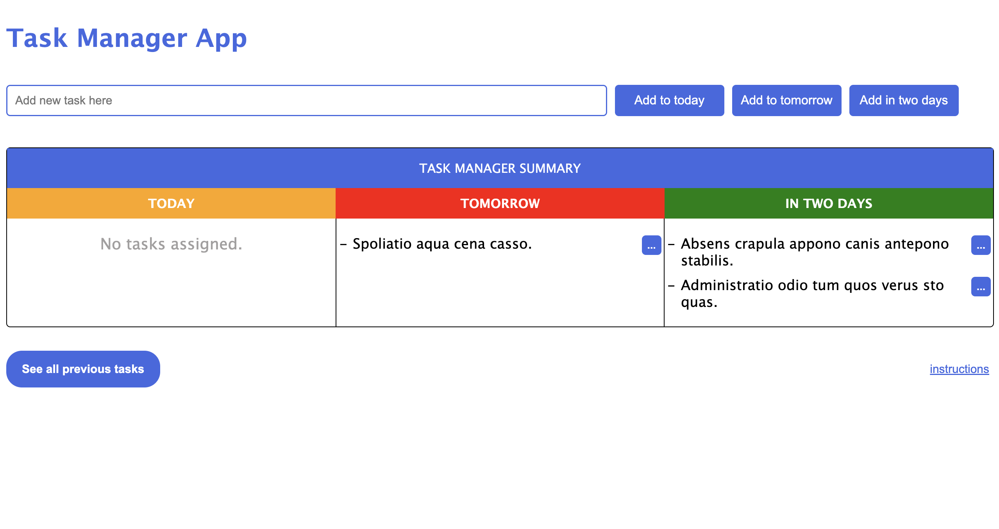
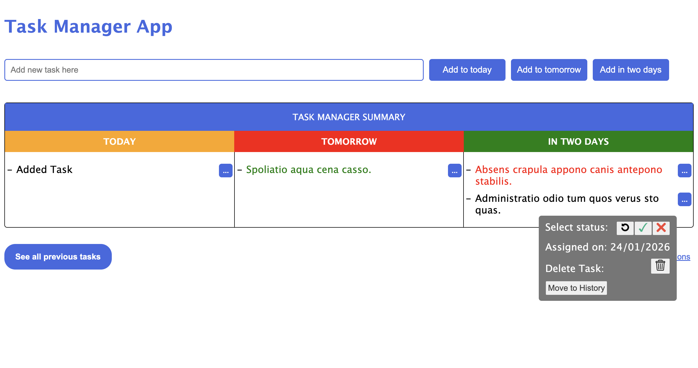
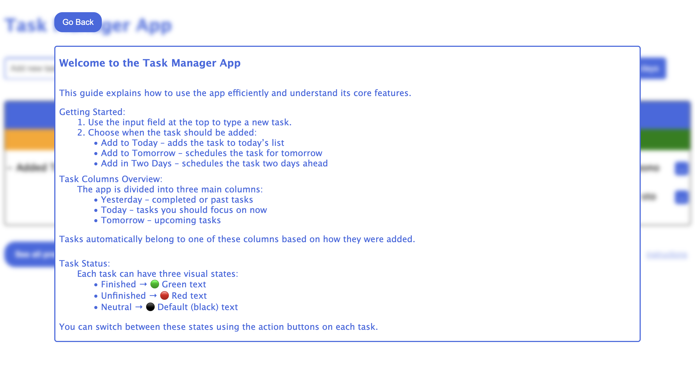
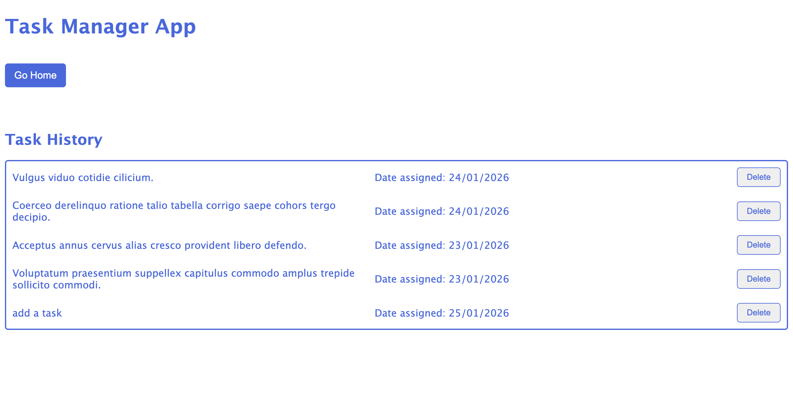

# Task Manager Application

A task management web application developed with React and TypeScript, designed to provide a clean and intuitive interface. Users can create, manage, and organize tasks, while the project demonstrates structured programming, component-based architecture, and basic state management techniques

---

## Features

- Create new tasks with a title and description  
- Mark tasks as completed  
- Delete tasks  
- Real-time UI updates using React state  
- Simple and clean user interface  

---

## Data Handling

The application uses a **simulated API** to fetch task data. This allows practice with asynchronous API requests and state management in React without requiring a real backend.

---

## Technologies

- React  
- TypeScript  
- JavaScript (ES6+)  
- HTML5  
- CSS3  

---

## Installation and Setup

1. Clone the repository:
```bash
git clone https://github.com/Nikolas0209/task-manager.git
```

2. Navigate to the project directory:
```bash
cd task-manager
```

3. Install dependencies:
```bash
npm install
```

4. Start the development server:
```bash
npm run dev
```

---

## Project Status

🚧 **In progress**  
Currently working on optimization for better efficiency.

---

## Future Improvements

- The project is functional as is; future improvements will be considered as I continue learning.

---

## Project Structure

```bash
task-manager/
├── node_modules/
├── public/
├── src/
│   ├── components/      # Reusable UI components
│   ├── pages/           # Page-level components
│   ├── App.tsx          # Root component
│   ├── main.tsx         # Entry point
│   └── App.css          # Styling
├── package.json
├── tsconfig.json
└── vite.config.ts 

---

## Screenshots

### Desktop View







